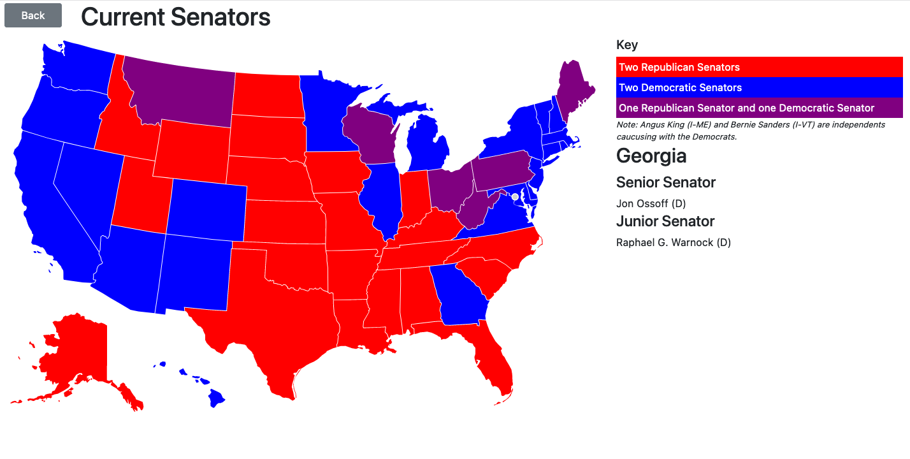
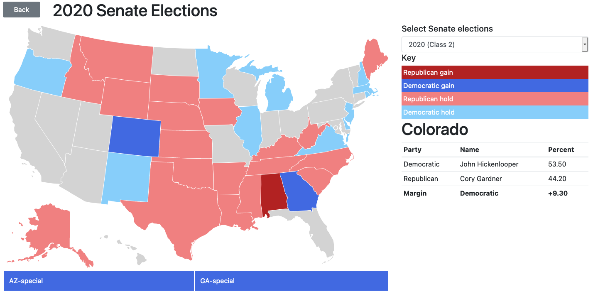
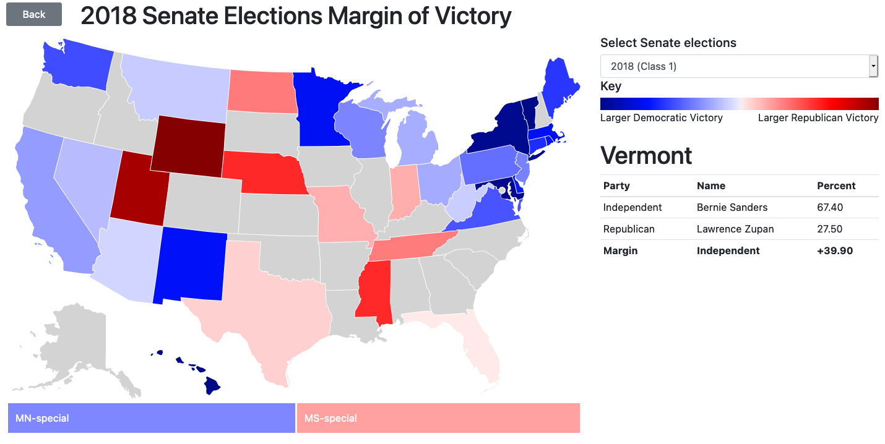
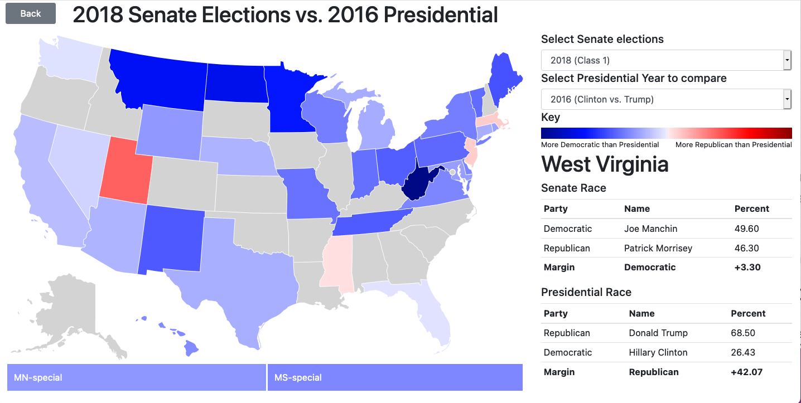
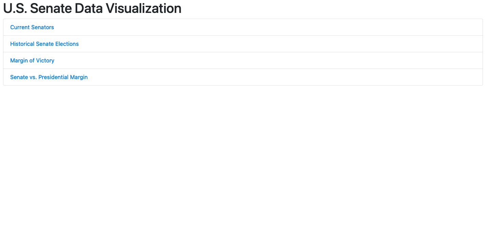

# data-viz-senate-elections

This is my final project for EECE 5642 in Spring 2021.

### Setup instructions

1. Clone the repo
2. Do `npm i`
3. Do `npm start`
4. The app should open at `localhost:3000`

### Technologies used

Language: JavaScript

Packages:

* React
* Bootstrap (for basic styling)
* [react-usa-map](https://www.npmjs.com/package/react-usa-map) (provides the US map)

### Information sources

https://theunitedstates.io/ for the current members of Congress

Wikipedia for Senate election results:

* [2020](https://en.wikipedia.org/wiki/2020_United_States_Senate_elections)
* [2018](https://en.wikipedia.org/wiki/2018_United_States_Senate_elections)
* [2016](https://en.wikipedia.org/wiki/2016_United_States_Senate_elections)
* [2014](https://en.wikipedia.org/wiki/2014_United_States_Senate_elections)
* [2012](https://en.wikipedia.org/wiki/2012_United_States_Senate_elections)
* [2010](https://en.wikipedia.org/wiki/2010_United_States_Senate_elections)
* [2008](https://en.wikipedia.org/wiki/2008_United_States_Senate_elections)
* [2006](https://en.wikipedia.org/wiki/2006_United_States_Senate_elections)
* [2004](https://en.wikipedia.org/wiki/2004_United_States_Senate_elections)
* [2002](https://en.wikipedia.org/wiki/2002_United_States_Senate_elections)
* [2000](https://en.wikipedia.org/wiki/2000_United_States_Senate_elections)

Wikipedia for Presidential election results:

* [2020](https://en.wikipedia.org/wiki/2020_United_States_presidential_election)
* [2016](https://en.wikipedia.org/wiki/2016_United_States_presidential_election)
* [2012](https://en.wikipedia.org/wiki/2012_United_States_presidential_election)
* [2008](https://en.wikipedia.org/wiki/2008_United_States_presidential_election)
* [2004](https://en.wikipedia.org/wiki/2004_United_States_presidential_election)
* [2000](https://en.wikipedia.org/wiki/2000_United_States_presidential_election)

### Screenshots

#### Current Senators Map

#### Election History Map

#### Margin of Victory Map

#### Presidential Comparison Map

#### Homepage

`\[[0-9]+\]`